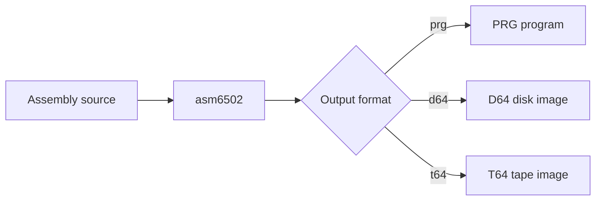
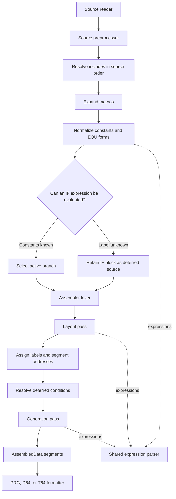

# 6502 Assembler

The `assembler` package assembles standard 6502 source into one or more memory
segments. It supports labels, expressions, macros, conditional assembly,
includes, and Commodore PRG, D64, and T64 output through the `output` package.

## Command-Line Use

Build the assembler from the repository root:

```bash
go build -o asm6502 ./cmd/assembler
```

Assemble a source file to a PRG:

```bash
./asm6502 -i program.asm
```

Select another output format or filename:

```bash
./asm6502 -i program.asm -o program.prg
./asm6502 -i program.asm -f d64 -n PROGRAM
./asm6502 -i program.asm -f t64 -n PROGRAM
./asm6502 -i program.asm -v
```

The available options are:

| Option | Purpose |
| --- | --- |
| `-i` | Input assembly file; required |
| `-o` | Output filename |
| `-f` | Output format: `prg`, `d64`, or `t64` |
| `-n` | Program name stored in D64 or T64 output |
| `-v` | Print segment and output details |
| `-h` | Show command help |
| `-version` | Show the assembler version |



## Go API

Use `Assemble` for source that does not contain includes:

```go
package main

import (
    "fmt"
    "strings"

    "github.com/jrsteele09/go-6502-emulator/assembler"
    "github.com/jrsteele09/go-6502-emulator/cpu"
    "github.com/jrsteele09/go-6502-emulator/memory"
)

func main() {
    mem := memory.NewMemory[uint16](64 * 1024)
    processor := cpu.NewCPU(mem, true)
    asm := assembler.New(processor.OpCodes())

    source := `
        org $1000
        lda #$42
        sta $d020
        rts
    `

    segments, err := asm.Assemble(strings.NewReader(source), "example.asm")
    if err != nil {
        panic(err)
    }

    for _, segment := range segments {
        fmt.Printf("$%04X: % X\n", segment.StartAddress, segment.Data.Bytes())
    }
}
```

Use `AssembleFile` when the source uses `#include` or `.include`. The resolver
determines where included files are loaded from:

```go
resolver := utils.NewOSFileResolver("./asm")
segments, err := asm.AssembleFile("main.asm", resolver)
```

`Assemble` and `AssembleFile` reset labels, constants, anonymous labels, and the
program counter before each assembly, so an `Assembler` instance can be reused.

## Source Syntax

```asm
FEATURE = 1
MASK EQU $ff & ~$04
ADDRESS .EQU $d020
.EQU VALUE, MASK + 1

LOAD_STORE macro value, target
    lda #value
    sta target
endm

org $1000

if FEATURE = 1
    LOAD_STORE VALUE, ADDRESS
endif

loop:
    dex
    bne loop

db $01, $02
dw loop
text "READY"
```

Supported constant forms are:

```asm
VALUE = expression
VALUE EQU expression
VALUE .EQU expression
.EQU VALUE, expression
.EQU VALUE = expression
```

Expressions support decimal, `$` hexadecimal, `%` binary, character literals,
parentheses, arithmetic, shifts, bitwise operators, comparisons, `lo()`/`hi()`,
and unary low/high-byte operators `<` and `>`.

Common directives include:

| Area | Forms |
| --- | --- |
| Origin | `org`, `.org`, or `* = expression` |
| Bytes | `byte`, `.byte`, `db`, or `.db` |
| Words | `word`, `.word`, `dw`, or `.dw` |
| Text | `text`, `string`, `str`, `asc`, `asciiz`, with optional leading `.` |
| Space | `ds` or `.ds` |
| Include | `#include "file.asm"` or `.include "file.asm"` |
| Conditional | `if`, `else`, and `endif` |
| Macro | `NAME macro ... endm` or `macro NAME ... endm` |

Anonymous `+` and `-` labels are also supported. Repeating the symbol selects a
separate anonymous-label namespace, for example `+`, `++`, or `---`.

## How It Fits Together



The expression parser is shared by preprocessing, layout, and generation. Each
phase supplies a different symbol resolver:

1. Preprocessing knows source constants but not label addresses.
2. Layout knows constants, the program counter, and labels already assigned.
3. Generation uses the completed symbol table.

When preprocessing encounters an undefined label in an `if` expression, it
retains the complete conditional block. Layout evaluates that same expression
when it reaches the block. Conditions may use constants or previously defined
labels. A condition using an unresolved forward label is rejected because its
branch could change the layout needed to determine that label.

The two assembler passes consume the same lexer token stream. Layout calculates
instruction sizes, labels, and segment starts; generation then emits bytes into
the resulting `AssembledData` segments.

## Testing

Run the assembler tests:

```bash
go test ./assembler/...
```

Run the complete repository suite, including the Klaus tests:

```bash
go test ./...
```

Use `go test -short ./...` to skip the Klaus integration tests.
